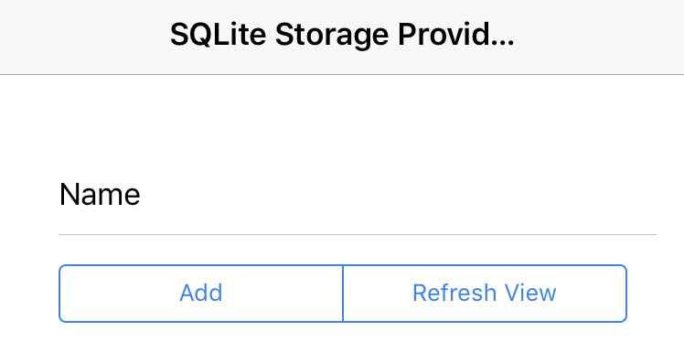
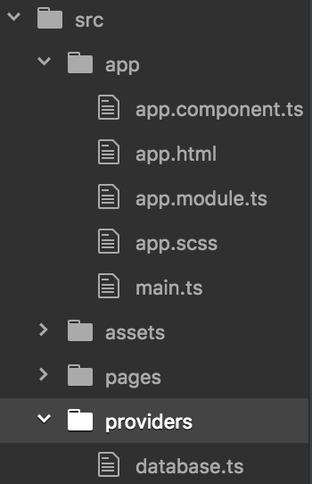
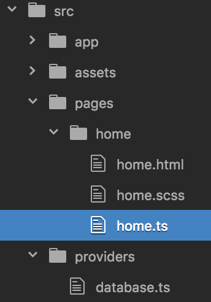
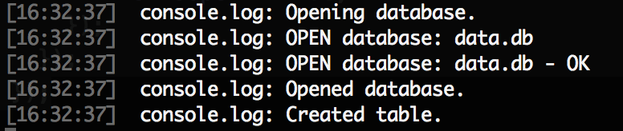

### Overview
Recently, Ionic 2 has re-organized its project structure. All the source code are relocated into the *src/* folder. In this folder, there are ***app***, ***pages*** and ***providers*** sub-folders:


- ***app***: Listing of user-created and system-defined components. A component is similar to a class or package in other languages.
- ***pages***: Each page is equivalent to a screen that users will see when using the app on mobile phone. Users can navigate back and forth among pages.
- ***providers***: Event handlers, error handlers, database... which handle underlying processes that users won't see on the phone.

For simplicity, this tutorial demonstrates with an one-page app having a button for adding a name from an input field into a database (SQLite storage) and another button for refreshing the view to reflect the new update.



### Starting with a blank Ionic 2 project

All the steps to initiate a new Ionic 2 blank project for running on ios or android platform can be found anywhere.
```
ionic start SqliteStorage blank --v2
cd SqliteStorage
ionic platform add ios
```
To add SQLite plugin into the project:
```
ionic plugin add cordova-sqlite-storage
```
We are planning to use SQLite as a *provider*. A provider is just a class, but not something users can see on the screen. A class handling what can be seen and interacted is called a *page*. A class providing additional underlying support such as database storage, error or event handling is listed as providers, or service providers.

Generate a provider class by this command `ionic -g provider <class_source_file_name>`. I will name this file as *database*, for example, and its class inside will be auto-generated as *class Database* subsequently:
```
ionic -g provider database
```
Some sources explain that SQLite has not been supported in ios or android simulation on browser platform. It is recommended to run the emulation so that SQLite is able to work properly.
```
ionic run ios -l -s -c
```
For debugging purpose, indicating `-l -s -c` to output log information onto the console and update the emulation as soon as a source file is saved. To target a specific device model, e.g. iPhone 6, add `--target="iphone-6"`.

### Initializing SQLite Storage

Open the `src\providers\database.ts` and import necessary modules:
```javascript
import { Platform } from 'ionic-angular';
import { SQLite } from 'ionic-native';
```
*SQLite* is of course a must-have. The *Platform* is required for checking the readiness before opening a database for further access.

Declare a new SQLite storage variable:
```javascript
private storage : SQLite;
```
Supply an additional parameter `platform: Platform` to the constructor:
```javascript
constructor(public http: Http, platform: Platform)
```
Make sure the platform is ready beforehand:
```javascript
platform.ready()
.then(() => {
    this.storage = new SQLite();
    console.log('Opening database.');
    this.storage.openDatabase({
      name: 'data.db',
      location: 'default' // the location field is required
    })
    .then(() => {
        console.log('Opened database.');
        this.storage.executeSql('create table IF NOT EXISTS People(name VARCHAR(32))', {})
        .then(()=>{
            console.log('Created table.');
        });
    });
});
```

This SQLite code is straightforward and self-explaining. The `.then( (`*some_variable*`) => {`*some_code*`} );` is actually an anonymous function (or lambda abstraction in some languages) nested inside a *promise-based* syntax `.then(`*do_something*`);`. This is for dealing with asynchronicity in Javascript. Refer to other sources for more detail. [This post](http://blog.rangle.io/the-art-of-promise-based-architecture/) is also a good start.

### Initializing ***app.module***

The *src/app/app.module.ts* is like a management center for all modules being used in a project. Hence, it should know where the source code for a module is:


```javascript
import { Database } from "../providers/database";
```
and the category of it. In this case, our *Database* class is a provider:
```javascript
providers: [Database, *other providers*]
```
Note that the relative path to the source file omits *.ts*. Ionic 2 would know all the code are in *type-script*.

### Initializing ***HomePage***

Our *HomePage* receives the name from user input and inserts into database. Once the user clicks the *Refresh View* button, data retrieved from database will be listed on the screen. Obviously, the *HomePage* needs to know the class providing this storage service and its source file location in the *src/pages/home/home.ts*:


```javascript
import { Database } from "../../providers/database";
```
Create an object and call the *Database*'s constructor through the *HomePage*'s constructor.
```javascript
constructor(public navCtrl: NavController, private database: Database)
```
Save all changes have been made so far and take a look at the console window. The SQLite service provider would print some log information if it is able to start properly.



### And the rest

Up to this point, we have gone through all major changes need to be made. The rest is similar to what it used to be. I will keep it brief just to make this tutorial completed.

#### Adding GUI components to the *HomePage*

Source file: *src/pages/home/home.html*

On the *HomePage* screen, user will type a name into an input field. The *HomePage* maintains a link between this input field and its variable `name`.
```html
<ion-item>
  <ion-label floating>Name</ion-label>
  <ion-input type="text" [(ngModel)]="name"></ion-input>
</ion-item>
```
It then needs two buttons for adding the new name to database and refreshing the view. These two buttons link to corresponding button-click event handlers.
```html
<div padding>
  <ion-segment>
    <ion-segment-button (click)="addPerson()">Add</ion-segment-button>
    <ion-segment-button (click)="refreshView()">Refresh View</ion-segment-button>
  </ion-segment>
</div>
```
Finally, all the names in database will need to be distributed into a list view. Assume that `itemList` is an array of *person* objects having a single information which is its name.
```html
<ion-list>
  <ion-item *ngFor="let person of itemList">
    \{\{person.name}}
  </ion-item>
</ion-list>
```
(The \\ in the above code snippet is because of GitHub Page inconsistent format! The actual code is \{{person.name}})
#### Linking *HomePage* GUI components to class variables and methods

Source file: *src/pages/home/home.ts*

Declare two variables for holding a name from user input and a list of names retrieved from database.
```javascript
public itemList: Array<Object>;
private name: string;
```

The GUI input field component with `[(ngModel)]="name"` will link to the class variable `name` has just been created above. Pass the user input value to the `createPerson` function in Database class:
```javascript
public addPerson(){
  this.database.createPerson(this.name);
}
```

When user clicks *Refresh View*, get a list of all the people's information (only a name in this tutorial) and assign those to `itemList`. Recall that this `itemList` later will be populated onto the *HomePage* screen's list view.
```javascript
public refreshView(){
  this.database.getPeople()
  .then( (result) => {
    this.itemList = <Array<Object>> result;
  });
}
```

#### Completing the database storage provider

Source file: *src/providers/database.ts*

As seen in the previous section, the *HomePage* will invoke two functions of the *Database* class upon user's interaction. Below are the definitions.

```javascript
public createPerson(name: string){
  return new Promise( (resolve, reject) => {
      var querry = "INSERT INTO People (name) VALUES (\'" + name + "\')";
      this.storage.executeSql(querry, {})
      .then( (data) => {
          resolve(data);
      }, (error) => {
          reject(error);
      });
  });
}

public getPeople(){
  return new Promise ( (resolve, reject) => {
    let people = [];
    this.storage.executeSql("SELECT * FROM People",{})
    .then( (data) => {
        if (data.rows.length > 0){
            for (let i = 0; i < data.rows.length; i++) {
                people.push( {
                  id: data.rows.item(i).id,
                  name: data.rows.item(i).name
                });
            }
        }
        resolve(people);
    }, (error) =>{
        reject(error);
    });
  });
}
```

### Wrapping up

This post is to provide another tutorial on SQLite storage provider in Ionic 2 with its new project structure. While this framework has been exploding with major updates, many tutorials are made deprecated. I have seen myself and some others struggled with all the mixing of Ionic 2 styles and try them all but nothing works. And the real solutions are just mentioned somewhere in the comments. This is just some effort to put them together.

Hope this helps!!!
