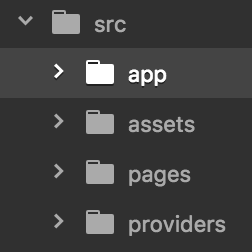

### Overview
Recently, Ionic 2 has re-organized its project structure. All the source code are put into the src/ folder. In this folder, there are ***app***, ***pages*** and ***providers*** sub-folders

 

- ***app***: Listing of user-created and system-defined components. A component is similar to a class or package in other languages.
- ***pages***: Each page is equivalent to a screen you will see when using the app on mobile phone. User can navigate back and forth between pages.
- ***providers***: Event handlers, error handlers, database..., which handle underlying processes that user won't see on the phone.

In this tutorial, we'll create an app with only one page (for simplicity) having a button for adding a name into the database (Sqlite storage) and one for refreshing the view to reflect the new update.
